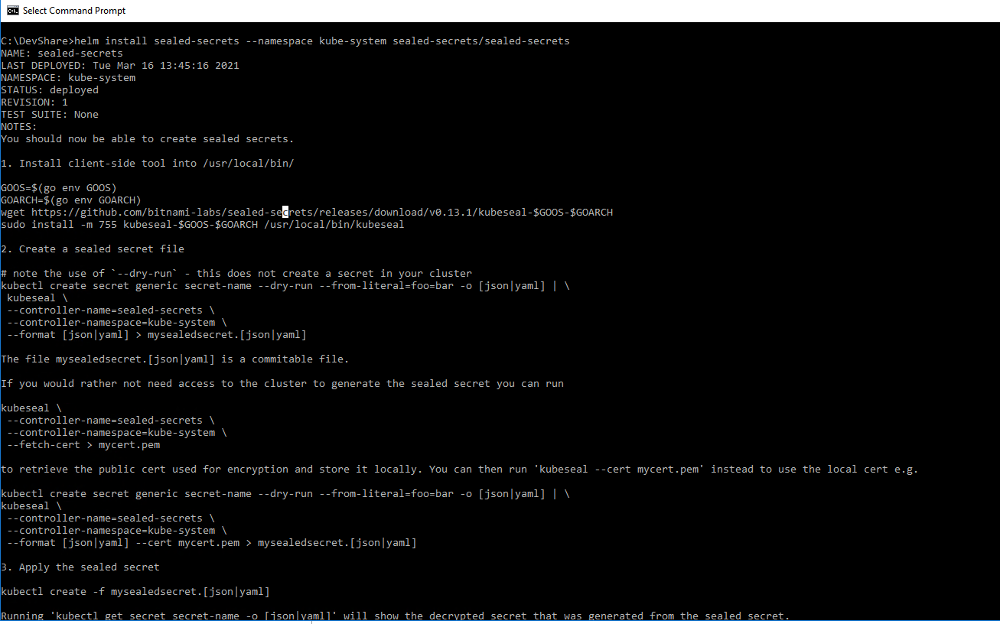
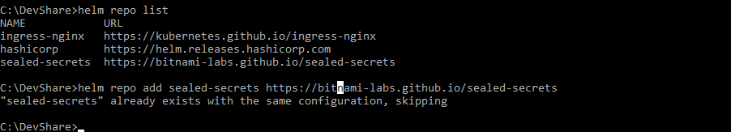
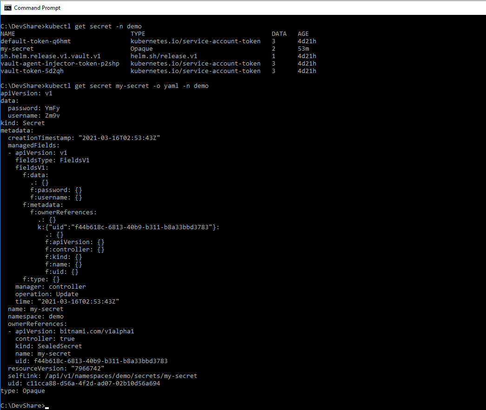
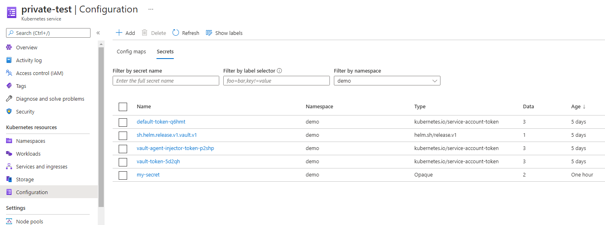

# Encrypting Kubernetes Secrets with Sealed Secrets
 
[Sealed Secrets](https://github.com/bitnami-labs/sealed-secrets "bitnami seal secret") is a solution to store encrypted Kubernetes secrets in version control.

### Installation via Helm chart

### Sealed Secrets consists of two components:

1. Client-side CLI tool to encrypt secrets and create sealed secrets
   安装 client tool: 
   ```
   Linux x86_64: 
   
   wget https://github.com/bitnami-labs/sealed-secrets/releases/download/v0.15.0/kubeseal-linux-amd64 -O kubeseal
   sudo install -m 755 kubeseal /usr/local/bin/kubeseal
   ```
   
   ```
   Macos: (might lag a few hours behind a new release, this icon will reflect that latest release)
   
   brew install kubeseal
   ```
   
2. Server-side (Cluster side) controller used to decrypt sealed secrets and create secrets

To install the controller in our Kubernetes cluster we’ll use the official Helm chart from the [sealed-secrets repository](https://github.com/bitnami-labs/sealed-secrets/tree/main/helm/sealed-secrets).

Add the repository and install it to the `kube-system` namespace:

安装版本
```
helm repo add sealed-secrets https://bitnami-labs.github.io/sealed-secrets

helm install sealed-secrets --namespace kube-system --version 1.13.2 sealed-secrets/sealed-secrets
```
or you can install via this way 安装最新版本
版本号码：[v0.15.0](https://github.com/bitnami-labs/sealed-secrets/releases)
```
kubectl apply -f https://github.com/bitnami-labs/sealed-secrets/releases/download/v0.15.0/controller.yaml
```



### CLI tool installation
Secrets are encrypted client-side using the kubeseal CLI tool.
For macOS, we can use the Homebrew formula. For Linux, we can download the binary from the GitHub release page.
```
# macos
brew install kubeseal

# linux
wget https://github.com/bitnami-labs/sealed-secrets/releases/download/v0.13.1/kubeseal-linux-amd64 -O kubeseal
sudo install -m 755 kubeseal /usr/local/bin/kubeseal
```

The `kubeseal` CLI uses the current kubectl context to access the cluster. Before continuing make sure that kubectl is connected to the cluster where Sealed Secrets should be installed.


### Creating a sealed secret
The `kubeseal` CLI takes a Kubernetes Secret manifest as an input, encrypts it and outputs a `SealedSecret` manifest.

In this tutorial we’ll use this secret manifest as an input:
```
apiVersion: v1
kind: Secret
metadata:
  creationTimestamp: null
  name: my-secret
data:
  password: YmFy
  username: Zm9v
```

Store the manifest in a file named `secret.yaml` and encrypt it:
```
cat secret.yaml | kubeseal \
    --controller-namespace kube-system \
    --controller-name sealed-secrets \
    --format yaml \
    > sealed-secret.yaml
```

The content of the sealed-secret.yaml file should look like this:

```
apiVersion: bitnami.com/v1alpha1
kind: SealedSecret
metadata:
  creationTimestamp: null
  name: my-secret
  namespace: default
spec:
  encryptedData:
    password: AgA...
    username: AgA...
  template:
    metadata:
      creationTimestamp: null
      name: my-secret
      namespace: default
```
We should now have the secret in secret.yaml and the sealed secret in `sealed-secret.yaml`.

To deploy the sealed secret we apply the manifest with kubectl:
```
kubectl apply -f sealed-secret.yaml
```
The controller in the cluster will notice that a SealedSecret resource has been created, decrypt it and create a decrypted Secret.
The data should contain our base64 encoded username and password:
```
...
data:
  password: YmFy
  username: Zm9v
...
```
Everything went well. The secret has been successfully unsealed.





Reference:
https://www.arthurkoziel.com/encrypting-k8s-secrets-with-sealed-secrets

### Updating a sealed secret
To update a value in a sealed secret, we have to create a new Secret manifest locally and merge it into an existing `SealedSecret` with the `--merge-into` option.

```
echo -n "my new password" \
    | kubectl create secret generic xxx --dry-run=client --from-file=password=/dev/stdin -o json \
    | kubeseal --controller-namespace=kube-system --controller-name=sealed-secrets --format yaml --merge-into sealed-secret.yaml

kubectl apply -f sealed-secret.yaml
```
The local secret is temporary and the name (xxx in our case) doesn’t matter. The name of the sealed secret will stay the same.

### Adding a new value to a sealed secret
The difference between updating a value and adding a new value is the name of the key. If a key named password already exists, it will update it. If it doesn’t exist, it will add it.
For example to add a new api_key key (--from-file=api_key) into our secret we run:
```
echo -n "my secret api key" \
    | kubectl create secret generic xxx --dry-run=client --from-file=api_key=/dev/stdin -o json \
    | kubeseal --controller-namespace=kube-system --controller-name=sealed-secrets --format yaml --merge-into sealed-secret.yaml

kubectl apply -f sealed-secret.yaml
```

### Deleting a value from a sealed secret
To delete a key from the sealed secret we have to remove it from the YAML file:
```
# BSD sed (macOS)
sed -i '' '/api_key:/d' sealed-secret.yaml

# GNU sed
sed -i '/api_key:/d' sealed-secret.yaml

kubectl apply -f sealed-secret.yaml
```
After applying the file, the controller will update the Secret automatically and remove the api_key.

### Delete the sealed secret
To delete the secret, we use kubectl to delete the resource:
```
kubectl delete -f sealed-secret.yaml
```
This will delete the SealedSecret resource from the cluster as well as the corresponding Secret resource.

## Conclusion

Sealed Secrets is a secure way to manage Kubernetes secrets in version control. The encryption key is stored and secrets are decrypted in the cluster. The client doesn’t have access to the encryption key.

The client uses the kubeseal CLI tool to generate SealedSecret manifests that hold encrypted data. After applying the file the server-side controller will recognize a new sealed secret resource and decrypt it to create a Secret resource.

Overall I’d recommend to use Sealed Secrets for improved security.


